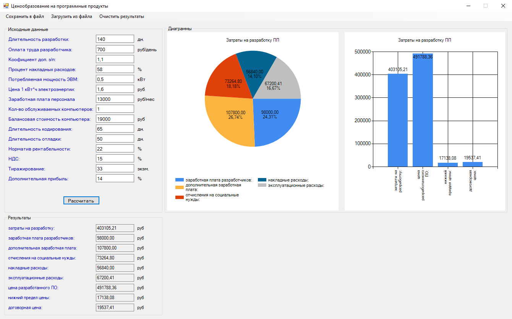
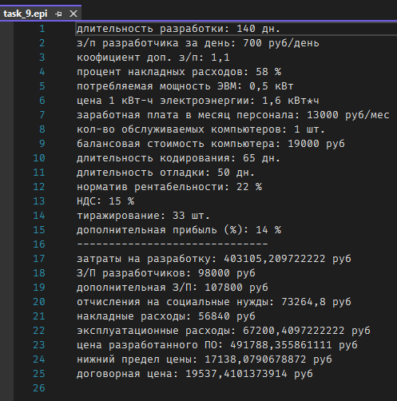

## Предмет: "Экономика программной инженерии"  

## Тема лабы: "Ценообразование на программные продукты"

### Задание:
Разработать программу расчета затрат (себестоимости), цены, нижнего предела цены, договорной цены программного продукта.  
Программа должна иметь графический интерфейс с полями для исходных данных и результатов с соответствующей экономической терминологией, причем с целью электронного документирования процесс решения задачи ценообразования должен протоколироваться и фиксироваться (исходные данные и результаты) самой программой в соответствующем файле.  
Программа должна также представить полученные результаты в графическом виде:  
- круговая диаграмма для затрат (себестоимости) на разработку ПП с указанием значений и долей (процентов) всех пяти составляющих этих затрат;
- диаграмма (гистограмма) для основных результатов решения задачи: затрат (себестоимости), цены, нижнего предела цены и договорной цены программного продукта.

### Результат:
Форма:  
  

Файл:  
  